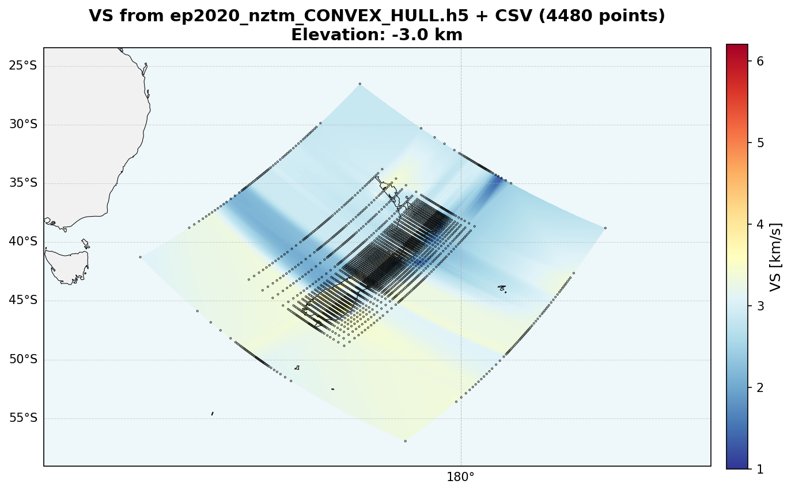
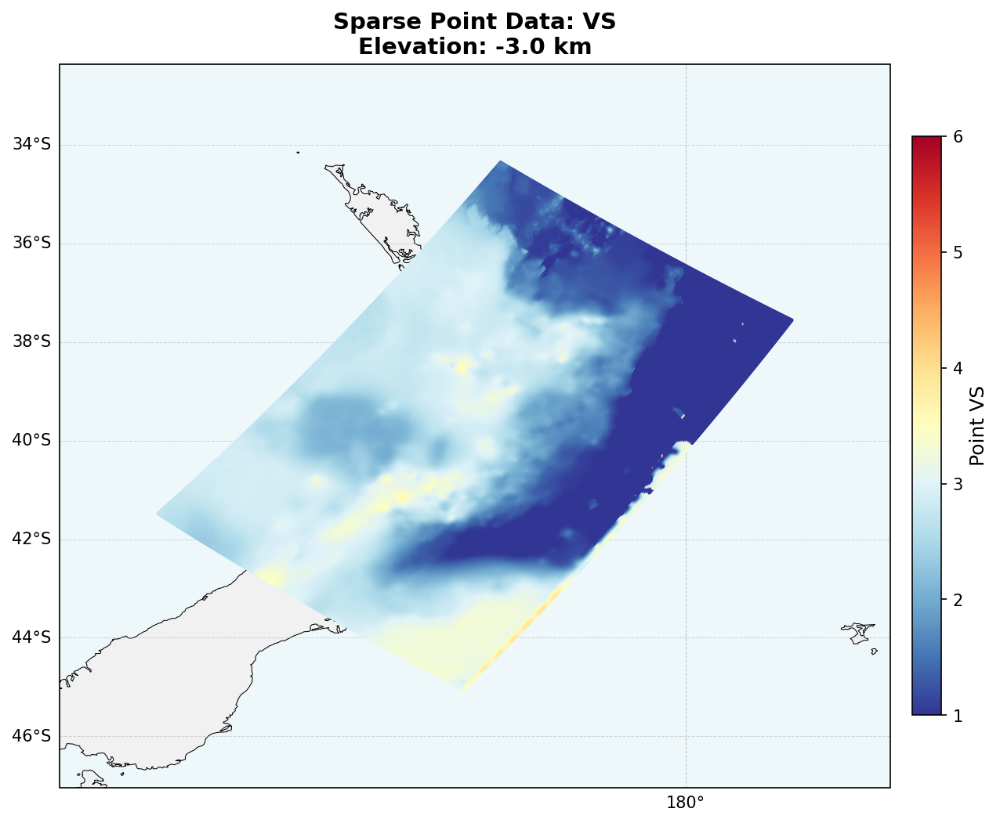
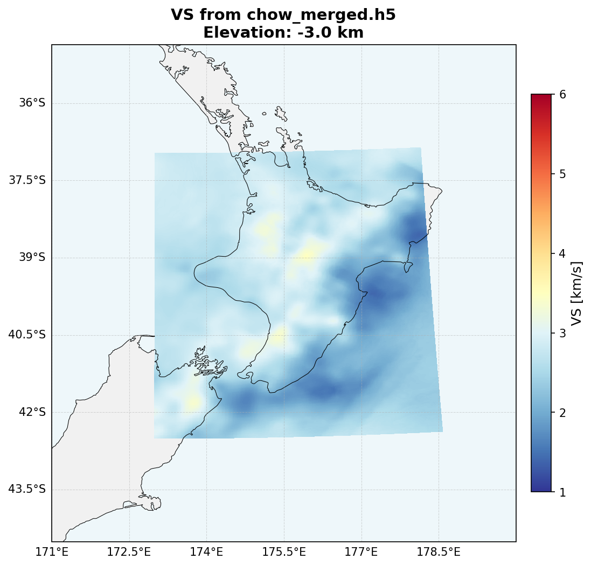

# NZTM Tomography Data Processing Toolkit

A modular Python toolkit for processing, interpolating, and visualizing seismic tomography velocity models in the New Zealand Transverse Mercator (NZTM) coordinate system. Handles large datasets from multiple sources (CSV, Parquet, NetCDF) and efficiently manages coordinate transformations between NZTM and WGS84.

## Overview

This toolkit converts raw tomography measurement data into analysis-ready formats suitable for visualization and comparison. It handles datasets ranging from sparse point measurements (5,000+ stations) to dense gridded models (30+ million points), maintaining data integrity through proper coordinate system management and International Date Line handling.

**Key Features:**
- Multi-format input support (CSV, Parquet, NetCDF)
- Sparse and gridded HDF5 output formats
- Efficient memory handling for large datasets (chunked Parquet loading)
- Automatic NZTM to WGS84 coordinate conversion (0-360° longitude)
- Interactive 2D mapping with optional CSV point overlay
- Ratio comparison mode for model differences

## Workflow

```
Raw Data (CSV/Parquet/NetCDF)
    ↓
[format_nztm_tomo_data.py] → Sparse HDF5
    ↓
[interpolate_nztm_tomo_data.py] → Gridded HDF5
    ↓
[map_nztm_tomo.py] → Publication-quality maps
```

Alternative workflows exist for pre-gridded data (CHOW2020) and diagnostic inspection.

## Scripts

### 1. format_nztm_tomo_data.py

Converts raw tomography data to sparse HDF5 format. Reads CSV, Parquet, or NetCDF files and reorganizes by elevation level while maintaining original measurement point locations.

**Input:** Raw data (CSV, Parquet, or NetCDF)  
**Output:** Sparse HDF5 with structure:
```
Root:
  x_nztm (1D array): unique X coordinates
  y_nztm (1D array): unique Y coordinates
Per elevation group (e.g., "-50.0"):
  data: structured array with columns (x_idx, y_idx, vp, vs, rho)
```

**Key Options:**
- `--x-nztm-col`, `--y-nztm-col`: Column indices for NZTM coordinates
- `--depth-col`: Depth column (negative down, unless `--already-elev` specified)
- `--vp-col`, `--vs-col`, `--rho-col`: Velocity/density columns
- `--compression`: Gzip compression level (0-9, default: 4)

### 2. interpolate_nztm_tomo_data.py

Interpolates sparse point data to a regular NZTM grid. Creates smooth continuous models from scattered measurements.

**Input:** Sparse HDF5 from format_nztm_tomo_data.py  
**Output:** Gridded HDF5 with structure:
```
Root:
  x_nztm (1D array): regular grid X coordinates
  y_nztm (1D array): regular grid Y coordinates
Per elevation group (e.g., "-50.0"):
  vp, vs, rho: 2D gridded data arrays (ny × nx)
```

**Key Options:**
- `--spacing`: Grid spacing in km (default: 2.0)
- `--method`: Interpolation method - "linear", "nearest", or "cubic" (default: linear)
- `--padding`: Extent padding around data in km (default: 10.0)

### 3. map_nztm_tomo.py

Creates 2D visualization maps of tomography data. Supports multiple modes including standard HDF5 plotting, point overlay, and ratio comparison.

**Modes:**
- **Standard:** Plot gridded HDF5 data
- **Overlay:** HDF5 gridded data with CSV point overlay
- **CSV-only:** Plot only CSV point data
- **Ratio:** Compute and plot ln(file2/file1) differences

**Key Options:**
- `--compared`: Second HDF5 file for ratio mode
- `--with-csv`: CSV file for point overlay
- `--csv-only`: CSV file for CSV-only mode
- `--scalar`: Field to plot (vp, vs, or rho)
- `--vmin`, `--vmax`: Color scale limits
- `--cmap`: Matplotlib colormap (default: RdYlBu_r for data, seismic for ratios)
- `--elevations`: Specific elevations to plot
- `--limits-mode`: "global" (default) or "local" color scaling
- `--no-cartopy`: Disable Cartopy map features (faster, basic matplotlib only)

### 4. peek_parquet.py

Diagnostic utility to inspect Parquet file structure without loading the entire file.

**Usage:**
```bash
python peek_parquet.py data.parquet
```

Shows column names, data types, sample values, and automatically identifies likely column indices for coordinates, velocities, and density.

### 5. inspect_nc_columns.py

Quick inspection of flattened NetCDF structure to identify column indices.

**Usage:**
```bash
python inspect_nc_columns.py file.nc
```

Converts xarray Dataset to DataFrame and displays column structure suitable for format_nztm_tomo_data.py.

## Usage Examples

### Example 1: EP2020 (CSV Format)

```bash
# Step 1: Convert CSV to sparse HDF5
python format_nztm_tomo_data.py EP2020_NZTM.csv \
  --x-nztm-col 11 --y-nztm-col 12 --depth-col 8 \
  --vp-col 0 --vs-col 2 --rho-col 3

# Step 2: Interpolate to regular grid
python interpolate_nztm_tomo_data.py EP2020_NZTM_sparse.h5 --spacing 2.0

# Step 3: Create visualization - with `--sparse` for overlay comparison
python map_nztm_tomo.py EP2020_NZTM_grid.h5 --scalar vs --elevations -3 --sparse EP2020_NZTM_sparse.h5 --vmin 1 --vmax 6
```

**Input file snippet:**
```
Vp,Vp/Vs,Vs,Density,...,x_nztm,y_nztm
2.91,1.74,1.68,2.27,...,1444087.0,7067042.0
```



### Example 2: BASSETT2025 (Parquet Format - Large)

```bash
# Step 0: Inspect structure (optional but recommended)
python peek_parquet.py DB2025_NZTM.parquet

# Step 1: Convert Parquet to sparse HDF5 (handles 33M+ rows with chunked loading)
python format_nztm_tomo_data.py DB2025_NZTM.parquet \
  --x-nztm-col 13 --y-nztm-col 14 --depth-col 2 \
  --vp-col 7 --vs-col 8 --rho-col 10

# Step 2: Interpolate to grid
python interpolate_nztm_tomo_data.py DB2025_NZTM_sparse.h5

# Step 3: Create maps : You can just load `sparse` data by omitting grid .h5 file.
python map_nztm_tomo.py --sparse DB2025_NZTM_sparse.h5 --scalar vs --elevations -3 \
  --vmin 1 --vmax 6 --no-outline-marker
```


### Example 3: CHOW2020 (NetCDF - Pre-gridded)

The CHOW2020 dataset consists of three pre-gridded NetCDF files (shallow, crust, mantle) at different resolutions. These should be merged before visualization.
No sparse .h5 file is separately created, and no interpolation is needed.

```bash
# Merge three CHOW2020 models (see separate merge_chow2020.py script)
python merge_chow2020.py \
  -s chow2020_shallow.nc \
  -c chow2020_crust.nc \
  -m chow2020_mantle.nc

# Directly visualize the merged gridded model
python map_nztm_tomo.py chow_merged.h5 --scalar vs --elevations -3 --vmin 1 --vmax 6
```



## Data Formats

### Input Formats

**CSV:** Standard comma-separated values with numeric columns for coordinates, depth, and velocities.

**Parquet:** Apache Parquet columnar format, efficiently loaded in chunks by row group to handle memory constraints.

**NetCDF:** xarray-compatible NetCDF files. Automatically flattened to DataFrame for processing.

### NZTM Coordinates

NZTM (EPSG:2193) coordinates are the primary working system:
- X: typically 1,200,000 to 2,400,000 meters
- Y: typically 4,000,000 to 7,000,000 meters

The toolkit automatically converts these to WGS84 (EPSG:4326) for visualization, with longitude normalized to 0-360° to handle New Zealand's position near the International Date Line.

### HDF5 Output Structure

**Sparse Format** (from format_nztm_tomo_data.py):
- Efficient storage for scattered measurements
- One elevation group per depth level
- Structured arrays with coordinate indices (x_idx, y_idx) for fast lookup
- ~240 MB for 33M point BASSETT2025 dataset

**Gridded Format** (from interpolate_nztm_tomo_data.py):
- Regular rectangular grid on NZTM coordinate system
- 2D arrays (ny, nx) for each velocity/density field per elevation
- Suitable for visualization and mathematical operations
- ~140 MB for interpolated BASSETT2025 dataset

## Depth vs. Elevation Convention

By default, depth columns are assumed to be positive downward (depth below sea level). The toolkit automatically converts these to elevation (positive upward) by multiplying by -1. Use `--already-elev` if your depth column is already in elevation convention.

```
Elevation = -Depth
Examples:
  Depth 50 km → Elevation -50 km (50 km below sea level)
  Depth -3 km → Elevation +3 km (3 km above sea level)
```

## Identifying Column Indices

Use the diagnostic utilities to find correct column indices:

```bash
# For Parquet files
python peek_parquet.py your_data.parquet

# For NetCDF files
python inspect_nc_columns.py your_data.nc

# For CSV, inspect manually or use standard Linux tools
head -1 your_data.csv | tr ',' '\n' | nl
```

The output shows column indices (0-based) needed for the `--*-col` arguments.


## Common Issues

**"Column index out of range"**
- Verify column indices match your actual data structure
- Use peek_parquet.py or inspect_nc_columns.py to confirm
- Remember indices are 0-based (first column is 0, not 1)

**"NZTM coordinates too small"**
- Check that x/y columns actually contain NZTM coordinates
- NZTM X should be ~1-2.4 million, Y should be ~4-7 million
- Don't confuse with longitude/latitude or UTM coordinates

**"Invalid fill values after interpolation"**
- Ensure fill_value handling is consistent (0.0 vs NaN)
- Check for NaN values in input data that should be masked
- Use --mask-value to exclude specific numeric fill values

**Large memory usage**
- Use chunked loading for Parquet files (done automatically)
- Process one elevation at a time if needed
- Reduce grid spacing to create smaller output files

## Performance Notes

- **EP2020 (CSV, 112k points):** Formatting ~1 second, sparse HDF5 ~1 MB
- **BASSETT2025 (Parquet, 33M points):** Formatting ~60 seconds, sparse HDF5 ~242 MB, gridded ~139 MB
- **CHOW2020 (NetCDF, pre-gridded):** Direct visualization, no formatting needed

Grid spacing significantly affects output size and visualization quality:
- 2.0 km spacing: balances detail and file size
- 1.4 km spacing: smoother results, larger files (~2x)
- 1.0 km spacing: maximum detail, ~4x larger files


